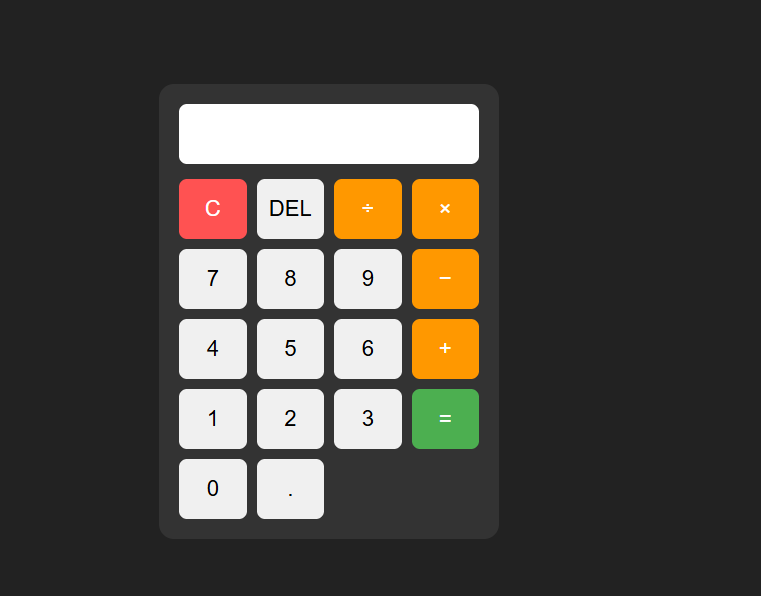

# JavaScript Calculator

A simple calculator application built with HTML, CSS, and JavaScript.

## Features

- Addition
- Subtraction
- Multiplication
- Division
- Decimal calculations
- Clear button
- Delete button
- Error handling

## Technologies Used

- HTML
- CSS
- JavaScript

## What I Learned

While building this project, I practiced:

- JavaScript functions
- DOM manipulation
- Handling button interactions
- Updating input values dynamically
- Basic error handling with try/catch
- Creating layouts with CSS Grid

## How to Use

1. Open the calculator.
2. Click the number buttons to enter a calculation.
3. Choose an operator (+, -, ×, or ÷).
4. Press `=` to calculate the result.
5. Use `C` to clear the calculator.
6. Use `DEL` to remove the last character.

## Screenshot

## Live Demo

[View the Live Calculator](https://sivanathilak.github.io/javascript-calculator/)
